# KG DSP v1.0

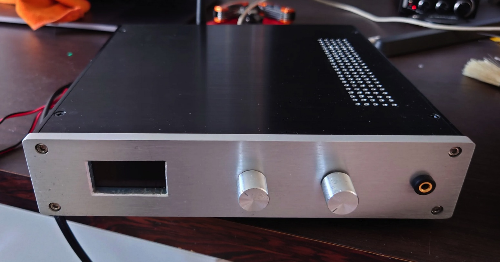
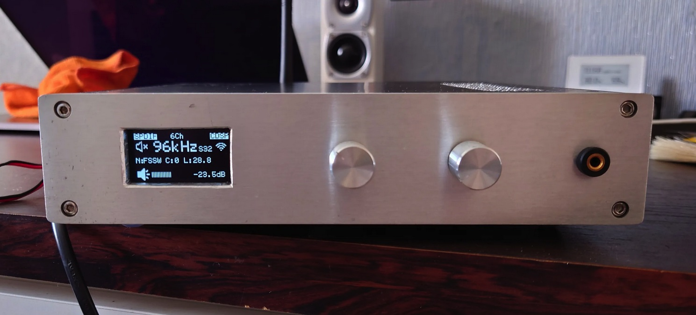
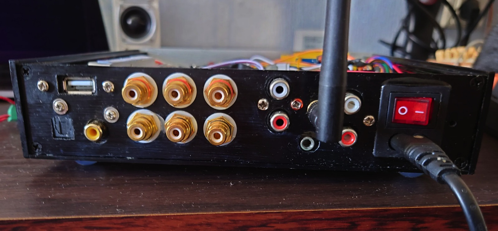
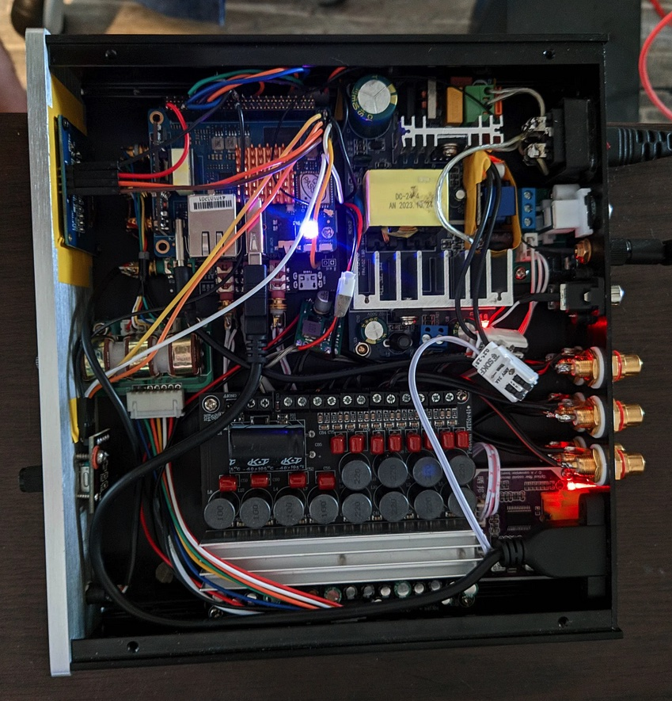

## Description

*Kirogaz DSP* is a "do it yourself" 8 channels OUT and 6 channels+USB UAC IN wireless streaming amplifier with software based DSP capabilities done during my spare time.

#### Main Features

- TPA3116D Class-D Audio Amplifier board, 4 x 50W + 2 x 100W channels 
- CS42448 DAC/ADC board with 8Ch OUT/6Ch IN+I2S AUX
- Banana Pi BPI-P2 SBC, Rockchip RK3308 based 64Bit control board
- WiFi 2.4Ghz/5Ghz, Bluetooth 5.0 support
- CamillaDSP - software DSP engine for IIR, FIR, crossovers, room correction etc
- USB Audio Class (UAC) gadget functionality
- DLNA renderer/AirPlay receiver support
- Open source and runs Linux :)

All the sound processing pipeline built using open source technologies - Linux, ALSA, CamillaDSP, Shairplay, Gmediarenderer etc thus everything can be customized at your own discretion.

## Hardware Parts

Component | Description | Comment
--- | --- | ---
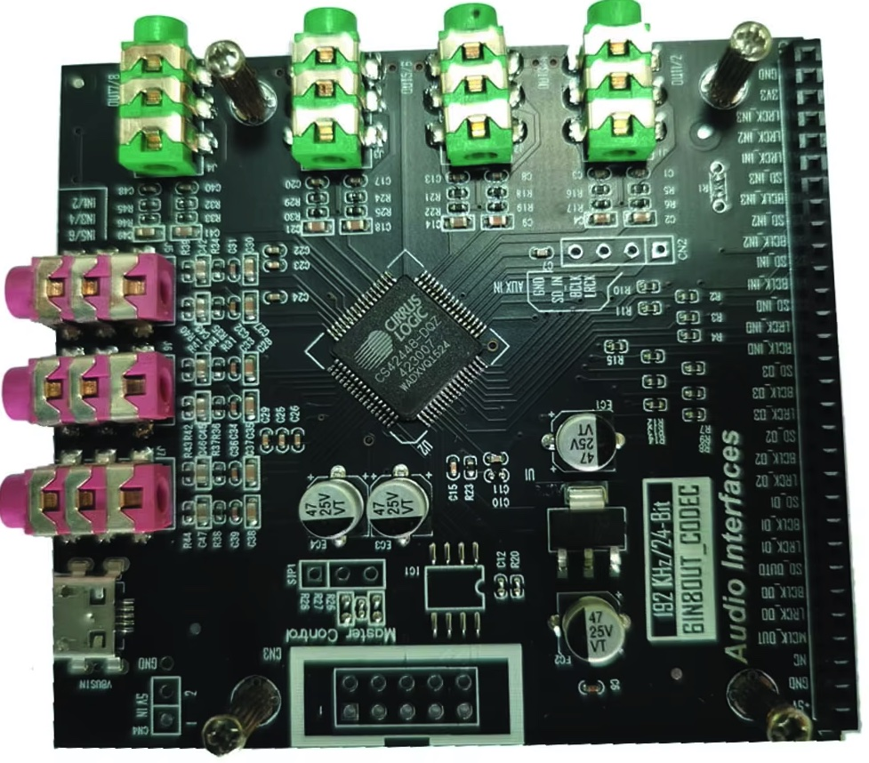| CS42448 DAC/ADC 6-in-8-out board [Aliexpress](https://www.aliexpress.us/item/1005007277368946.html) | Works as I2S TDM Slave, supports I2C or SPI control communication method
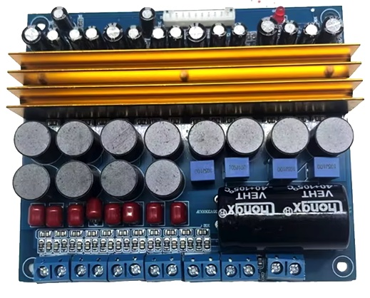| TPA3116D 5.1 Channel Amplifier [Aliexpress](https://www.aliexpress.us/item/1005005861085634.html) | A bit hissy due to over increased output volume. There's a hardware mod found on the diyAudio forum regarding reducing hiss. 
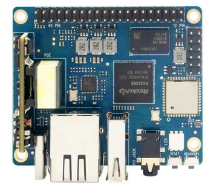 | Banana Pi BPI-P2 PRO Rockchip RK3308 64bits Quad-core Arm Cortex-A35 512M DDR3 8G eMMC Support WiFi Bluetooth [Aliexpress](https://www.aliexpress.us/item/1005005948457324.html)| RK3308 has wide capabilities for audio processing and enough power to run CamillaDSP
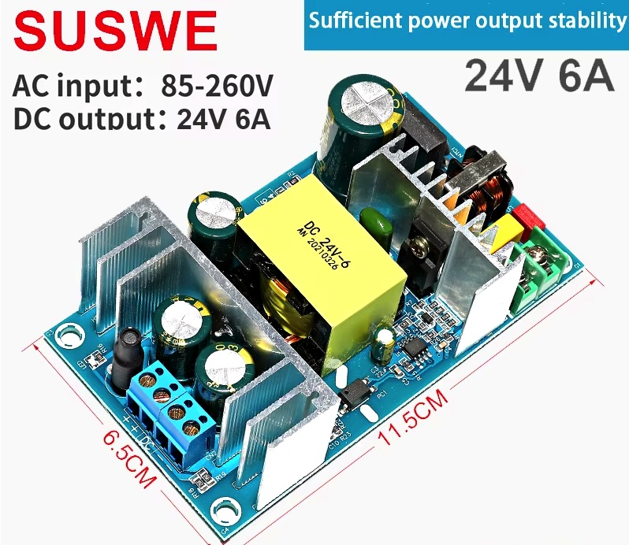| 24V-6A switching power PSU to power up amplifier board [Aliexpress](https://www.aliexpress.us/item/1005005496549344.html)| But yeah, linear is always better :)
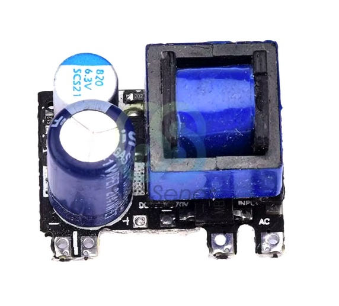 | AC-DC 220V to 5V 1000mA to power up the BPi2 SBC board [Aliexpress](https://www.aliexpress.com/item/1005005021311232.html)| To avoid compute & ground line noise separate power source is a MUST
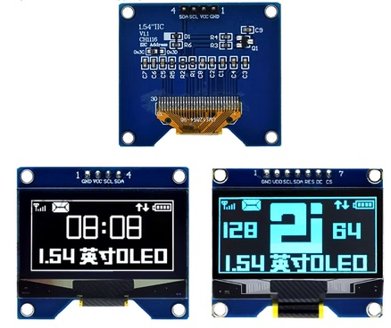| TZT 1.54" White OLED Screen Module SSD1309 I2C [Aliexpress](https://www.aliexpress.us/item/1005005985453225.html)| Control display
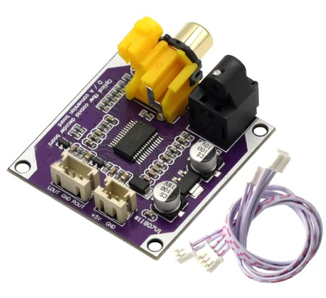| SPDIF 24bit 192khz Optical Fiber Coaxial Digital Signal Input Stereo Output Decod board [Aliexpress](https://www.aliexpress.us/item/1005004088479626.html)| SPDIF input to analog converter. But it's better to use SPDIF->I2S converter since CS42448 board has I2S AUX input.
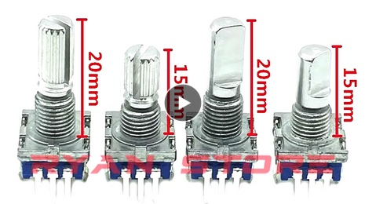| 360 Degree Rotary Encoder With Push Button Switch [Aliexpress](https://www.aliexpress.us/item/1005006054325437.html)| For display menu navigation
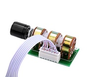| 6CH volume control potentiometer [Aliexpress](https://www.aliexpress.us/item/1005005072929281.html)| For analog volume control
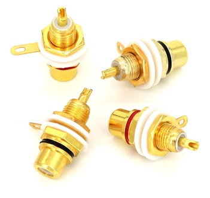| RCA Female Audio Terminal Plug 3.5mm [Aliexpress](https://www.aliexpress.us/item/1005002892071331.html)| Analog output connectors
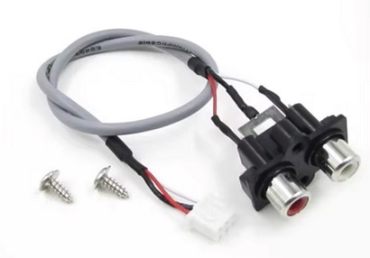| RCA Female Audio Terminal Plug 3.5mm [Aliexpress](https://www.aliexpress.us/item/1005002892071331.html)| Analog input connectors
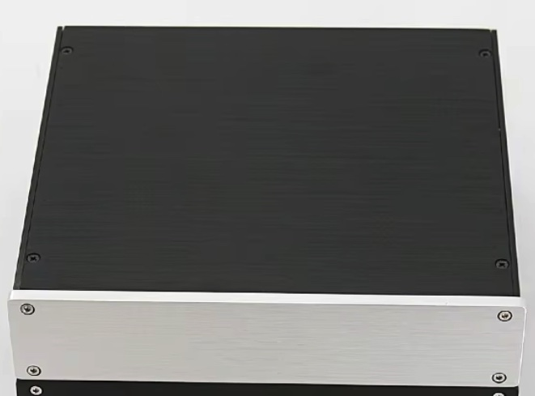| 210x46x191mm All-aluminum Power Amplifier Chassis [Aliexpress](https://www.aliexpress.us/item/1005004699076752.html)| 

## Prototyping

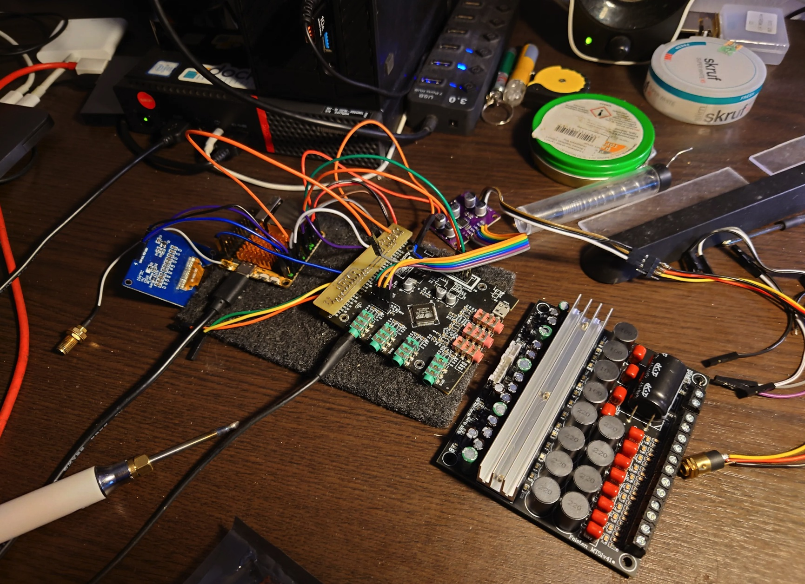
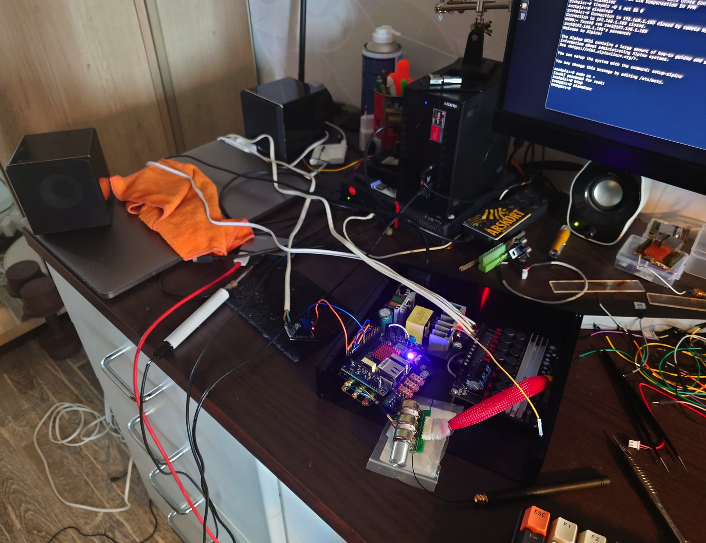

## Software

Linux - customized minimal dsitro based on Alpine Linux. I'm not using Buildroot or any similiar tools, just a set of simple shell scripts & plain-text configuration files.

##### Alpine Linux image build system for various SBCs:
> [https://github.com/faust93/Alpine-Linux-SBC.git](https://github.com/faust93/Alpine-Linux-SBC.git)

Customized Linux 6.1.43 Kernel for BPI2-PRO:
> [https://github.com/faust93/kernel-6.1.43_bpi-pi2-pro](https://github.com/faust93/kernel-6.1.43_bpi-pi2-pro)

##### Control daemon and helper scripts
To configure & control the amplifier I use a set of scripts and simple daemon written in Go:

> [https://github.com/faust93/diy-kg_dsp](https://github.com/faust93/diy-kg_dsp)

#### Other Components & Dependencies

Shairport Sync is an AirPlay audio player for Linux and FreeBSD. It plays audio streamed from Apple devices:
> [https://github.com/mikebrady/shairport-sync.git](https://github.com/mikebrady/shairport-sync.git)

GMediaRender fork - UPnP/DLNA media renderer for Linux:
> [https://github.com/hzeller/gmrender-resurrect.git](https://github.com/hzeller/gmrender-resurrect.git)

CamillaDSP:
> [https://github.com/HEnquist/camilladsp](https://github.com/HEnquist/camilladsp)

---

**TG**: @faust93

**Email**: <monumentum@gmail.com>